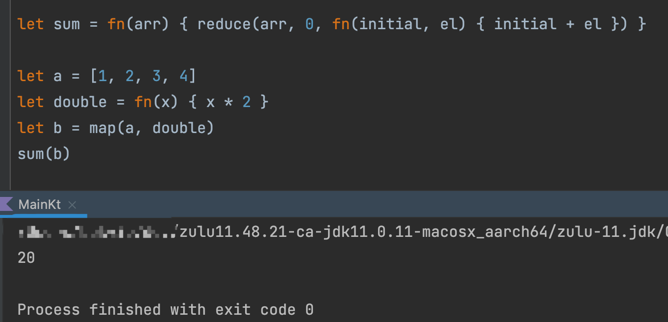
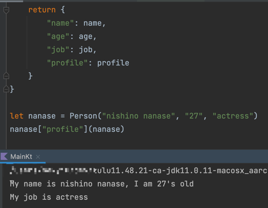
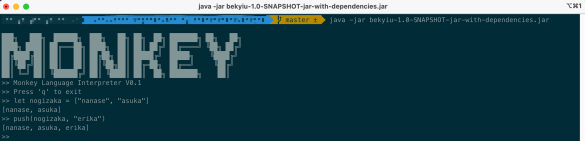

# The implementation of Monkey Language by kotlin
## What is Monkey
Monkey Language is a language created to learn how interpreter/compiler works
Here is the official website: https://monkeylang.org/

## What Monkey looks like
There are two examples, more syntax details can be found on the official website
```
let map = fn(arr, f) {
    let iter = fn(arr, accumulated) {
        if (len(arr) == 0) {
            accumulated
        } else {
            iter(rest(arr), push(accumulated, f(first(arr))))
        }
    }
    iter(arr, [])
}

let reduce = fn(arr, initial, f) {
    let iter = fn(arr, result) {
        if (len(arr) == 0) {
            result
        } else {
            iter(rest(arr), f(result, first(arr)))
        }
    }
    iter(arr, initial)
}

let sum = fn(arr) { reduce(arr, 0, fn(initial, el) { initial + el }) }

let a = [1, 2, 3, 4]
let double = fn(x) { x * 2 }
let b = map(a, double)
sum(b)
```
The result:


```
let Person = fn(name, age, job) {

    let profile = fn(this) {
        puts(
            "My name is " + this["name"] + ", I am " + this["age"] + "'s old",
            "My job is " + this["job"]
        )
    }

    return {
        "name": name,
        "age": age,
        "job": job,
        "profile": profile
    }
}

let nanase = Person("nishino nanase", "27", "actress")
nanase["profile"](nanase)
```
The result:



## Where to start
The source code tested successfully with kotlin1.6 and on jdk11

The program entry is in file: src/main/kotlin/bekyiu/Main.kt
```
fun main(args: Array<String>) {
//    repl()
    evalFromFile(args[0])
}
```
you can write the monkey code in a single file and pass the full file path by program arguments
or run the REPL like this:


